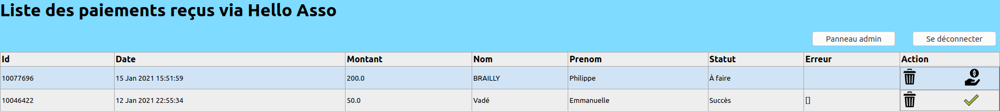
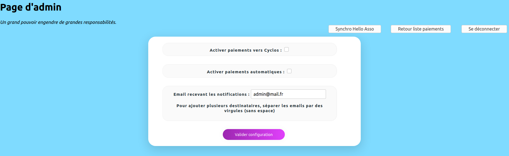

# Manuel utilisateur

## Login
Les utilisateurs et le mot de passe associé est défini dans le fichier `.env`, qui doit être placé
dans le même répertoire que l'exécutable.

## Gestion des droits
Une fois connecté, l'utilisateur arrive sur la liste des paiements. Il n'y a actuellement pas
de gestion de rôles dans l'application. Donc tous les utilisateurs peuvent effectuer les mêmes actions.

## Liste des paiements
Les paiements sont alimentés directement par Hello Asso (configuration à faire côté Hello Asso et coté Hellos).
Pour chaque paiement, deux actions sont disponibles : 
- supprimer le paiement dans Hellos (pas d'effet dans Hello Asso ni Cyclos) en cliquant sur l'icône "poubelle"
- effectuer le paiement dans Cyclos, en cliquant sur l'icône "main avec dollar"

Quand un paiement est effectué, le status est mis à jour en fonction de la réussite ou de l'échec du paiement dans Cyclos.
Si le paiement a été réalisé avec succès dans Cyclos, une coche verte remplace le bouton "main avec dollar", afin d'éviter les doubles paiements.

Deux autres boutons sont disponibles : un pour aller vers le panneau d'administration et un pour se déconnecter.

### Statuts possibles pour un paiement
Un paiement peut être dans différents statuts : 
 - À faire : Paiement à réaliser manuellement
 - Montant trop haut : Montant trop haut par rapport à la limite définie dans le .env
 - En retard : Hello Asso a envoyé le paiement avec trop de retard (défini dans le .env)
 - Reactiver les paiements pour effectuer le paiement : le paiement vers Cyclos a été désactivé
 - Succès : Paiement crédité dans Cyclos
 - Succès (automatique) : Paiement crédité dans Cyclos
 - Echec : Erreur lors du paiement
 - En attente : Paiement reçu à l'état "Waiting", à effectuer manuellement

## Panneau d'administration
Il permet principalement de mettre à jour différentes configurations :
- Activation des paiements de Cyclos
- Activation des paiements automatiques
- Destinataire(s) des emails d'Hellos

Un bouton permettant de récupérer manuellement les paiements dans Hello Asso est disponible. Il est utile en cas de défaillance côté Hello Asso (parfois les notifications n'arrivent pas)

### Notification par emails
En cas d'erreur, un mail avec des informations techniques est envoyé.
En mode automatique, un mail est envoyé dans tous les cas, en cas d'échec comme en cas de succès.
